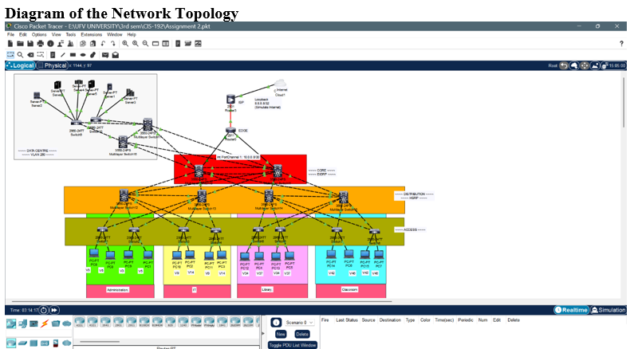

# network-security-design-lab

A full network design and simulation project implementing a 3-layer hierarchical campus network for the University of the Fraser Valley. Configured using Cisco IOS in Packet Tracer, covering 4 departments across 14+ devices with VLAN segmentation, redundancy, and security hardening.

## Overview

| | |
|---|---|
| Course | CIS-192 — Network Infrastructure |
| Institution | University of the Fraser Valley |
| Tools | Cisco Packet Tracer, Cisco IOS |
| Departments | Administration, IT, Library, Classrooms |
| Devices | 2 Core switches, 4 Distribution switches, 8 Access switches, 15+ PCs |

## Network Architecture



*Figure 1: 3-layer hierarchical campus network design*

### VLAN & IP Addressing Plan

| Department | VLANs | Subnet |
|---|---|---|
| Administration | 3, 5 | 192.168.3.0/24, 192.168.5.0/24 |
| IT | 9, 14 | 192.168.9.0/24, 192.168.14.0/24 |
| Library | 34, 37 | 192.168.34.0/24, 192.168.37.0/24 |
| Classrooms | 42, 46 | 192.168.42.0/24, 192.168.46.0/24 |

## Technologies Configured

### Core Layer
- **EtherChannel (LACP)** — Bundled links for redundancy and increased bandwidth
- **OSPF / EIGRP** — Dynamic routing for automatic failover and route management

### Distribution Layer
- **Inter-VLAN Routing** — Cisco 3560-24PS multilayer switches
- **HSRP (Hot Standby Router Protocol)** — Router redundancy with virtual IP failover
- **GigabitEthernet uplinks** — High-speed core-to-distribution connections

### Access Layer
- **VLAN assignment** — Each port assigned to department VLAN
- **Port Security** — MAC address sticky, max 1 device per port
- **ACLs** — Traffic filtering per department

## Key Configuration Snippets

**VLAN Assignment:**
```
Switch(config)# vlan 3
Switch(config-vlan)# name Administration
Switch(config)# interface g0/1
Switch(config-if)# switchport mode access
Switch(config-if)# switchport access vlan 3
```

**Port Security:**
```
Switch(config-if)# switchport port-security
Switch(config-if)# switchport port-security maximum 1
Switch(config-if)# switchport port-security mac-address sticky
Switch(config-if)# switchport port-security violation restrict
```

**HSRP Failover:**
```
Router(config-if)# standby 1 ip 192.168.3.5
Router(config-if)# standby 1 priority 110
Router(config-if)# standby 1 preempt
```

## Testing & Results

All connectivity verified with Cisco Packet Tracer:
- Intra-VLAN ping tests: **100% success rate**
- Inter-VLAN routing: **confirmed working**
- HSRP failover simulation: **standby router took over successfully**
- EtherChannel: **load balancing and redundancy verified**

## Repository Contents

```
secure-campus-network/
├── Secure_Campus_Network_Design_Report.docx   # Full design report
├── screenshots/
│   └── network-topology.svg                   # Topology diagram
└── README.md
```

> If you have the Packet Tracer `.pkt` file, add it here and link to it for full simulation access.

## Author

**Ranjit Gautam**
- GitHub: [@ranjitgautam828-eng](https://github.com/ranjitgautam828-eng)
- LinkedIn: [linkedin.com/in/ranjit-gautam-5b7ab2238](https://linkedin.com/in/ranjit-gautam-5b7ab2238)
- Portfolio: [ranjitgautam828-eng.github.io/ranjit-gautam-portfolio](https://ranjitgautam828-eng.github.io/ranjit-gautam-portfolio/index.html)

---

*Built for CIS-192 at the University of the Fraser Valley.*
